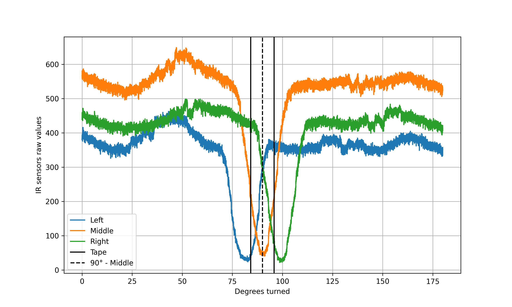

# Line Follower - Line Detection

The robot makes a 180° turn using both motors turning at the same speed in opposite directions and records infrared (IR)
sensor values as it moves over a 1.5 cm wide black tape.

## Raw Data

The raw sensor data collected by the robot is stored in the following file:
- `raw_collected_data/data.txt`

## Processed Data

