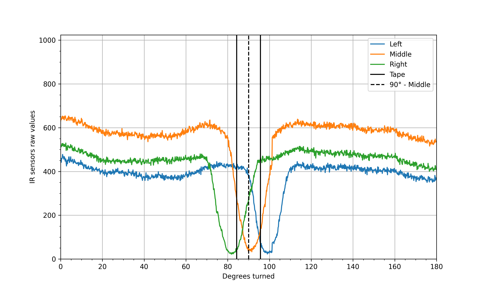

# Line Follower - Line Detection

The robot makes a 180° turn using both motors turning at the same speed in opposite directions and records infrared (IR)
sensor values as it moves over a 1.5 cm wide black tape.

## Results

| Config                           | Processed Data                 |
|----------------------------------|--------------------------------|
| [0](../robi_configs/robi_0.json) |  |
| [1](../robi_configs/robi_1.json) |  |
