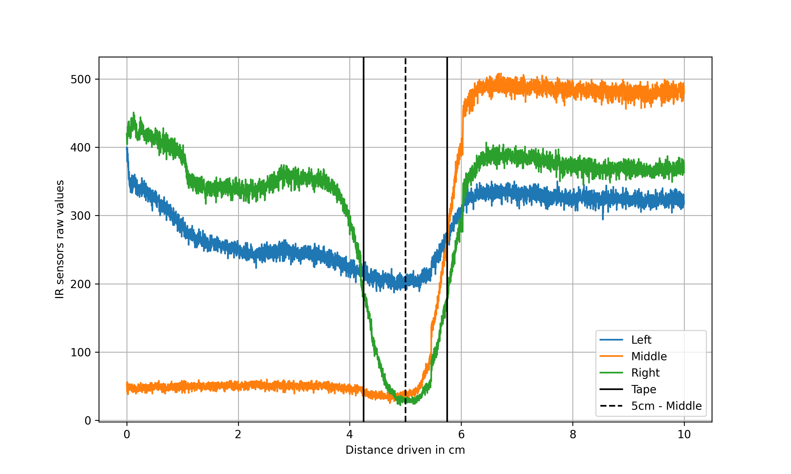

# Line Follower - 90° Corner

The robot, traverses a 10 cm distance, where the right IR sensor detects the center of the 90° angled black tape after 5
cm of movement.

## Results

| Config                           | Raw Data                                  | Processed Data                 |
|----------------------------------|-------------------------------------------|--------------------------------|
| [0](../robi_configs/robi_0.json) | [Raw Data](raw_collected_data/data_0.txt) |  |
