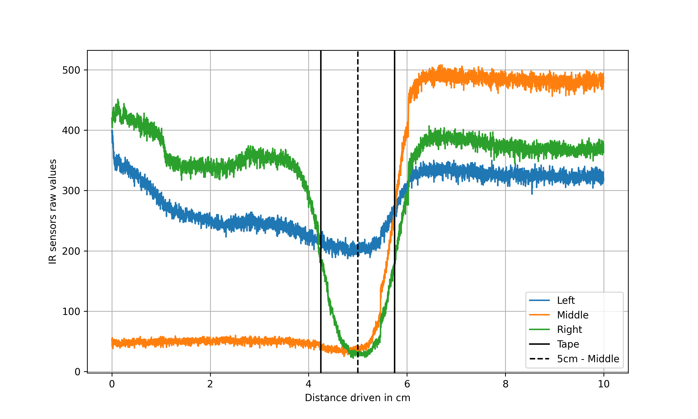

# Line Follower - 90° Corner

The robot, traverses a 10 cm distance, where the right IR sensor detects the center of the 90° angled black tape after 5
cm of movement.

## Robi Properties

- Track width: 14.7cm
- Wheel radius: 3.2cm
- IR sensor plate height: 1.2cm

## Raw Data

The raw sensor data collected by the robot is stored in the following file:

- `raw_collected_data/data.txt`

## Processed Data

